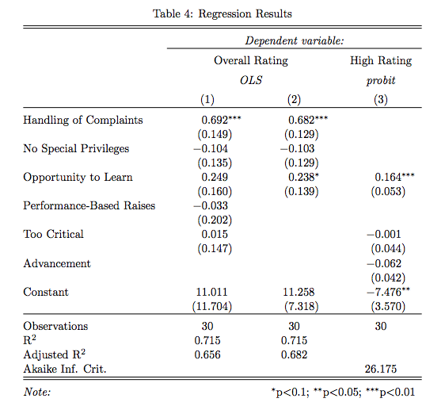

a workflow for slides and papers
========================================================
author: sebastian barfort
date: NUMEDIG, april 2014

========================================================

## Writing academic papers is a pain

- not only do you need a good idea 
- you also need to turn that idea into a nice looking product
- the focus today is the process from idea to product
    - most of you probably use either MS Word or LaTeX?
    - I'll try to make the case for a more stripped down text file approach

========================================================

## What do we want?

- academic papers
- nice looking slides to sell our ideas

## How do we want them?

- today: primarily pdf
- in the future (but the future is now): also html 

The perfect workflow
====================================
<small>
**input**
- text
- equations
- plots 
- tables
- citations

***
**output**

- pdf or html
- because of some unexplainable facts about the world: docx
- we do not want to worry about citations, equations, etc.
- we *do not* want to do any post-processing (this is tedius and not reproducible)
</small>

========================================================

If only there were some program that could do all these things...


Enter: Pandoc!
=============
type:section


Pandoc 
====================================
- written by John Macfarlane (philosophy prof at UC Berkeley, *hobby* programmer)
- Pandoc is your swiss-army knife for document conversion
- Among a huge set of inputs, Pandoc accepts LaTeX

***


========================================================

### Article

1. `.tex` to `.html`

    pandoc -s  paper.tex -o paper_tex.html

2. `.tex` to `.docx`

    pandoc -s  paper.tex -o paper_tex.docx

*** 

### Slides

1. `.tex` to beamer slides 

    pandoc -t beamer slides.tex  -o slides_tex.pdf


2. `.tex` to `.html` slides 

    pandoc -s --mathml -i -t dzslides slides.tex -o slides_tex.html

3. using the slidy framework

    pandoc -s --mathml -i -t slidy slides.tex -o slides_tex.html


If you absolutely love LaTeX, stop here...
=============
type:section

========================================================

## I think we can do better

- I can write an entire slideshow in the time it takes you to type `\documentclass{beamer}`, `\title{}`, etc
- I never remember the commands 
- I never understand the error messsages
- ... and I think beamer slides are ugly

========================================================

If only there were ever some simpler program that could give us the same funtionality...


Enter Markdown!
=============
type:section

========================================================

## Markdown philosophy

> - writing should not be an alienating experience trapped in WYSIWYG editors
> - a file should be readable intuitively and not be buried in markup
> - markdown *is* a markup language, but one meant to be read by humans rather than machines

- markdown was created for the web (you know it if you use Github, Stackoverflow, etc.)

========================================================

## Example

Suppose we want to create a nested list

* fruits
    - apples
        - macintosh
        - red delicious
    - pears 
    - peaches
* vegetables
    - broccoli
    - chard

========================================================

## Latex

    \begin{itemize}      
    \item fruits         
        \begin{itemize}       
        \item apples          
            \begin{itemize}     
            \item macintosh     
            \item red delicious 
            \end{itemize}       
        \item pears           
        \item peaches         
        \end{itemize}         
    \item vegetables        
        \begin{itemize}       
        \item brocolli        
        \item chard           
        \end{itemize}         
    \end{itemize}    

========================================================

## HTML

    <ul>
        <li>fruits
        <ul>
            <li>apples
            <ul>
                <li>macintosh</li>
                <li>red delicious</li>
            </ul></li>
            <li>pears</li>
            <li>peaches</li>
        </ul></li>
        <li>vegetables
        <ul>
            <li>brocolli</li>
            <li>chard</li>
        </ul></li>
    </ul>                       

========================================================

## Markdown 
    * fruits
        - apples
            - macintosh
            - red delicious
        - pears 
        - peaches
    * vegetables
        - broccoli
        - chard

========================================================

### Article

1. `.md` to `.html`

    pandoc -s paper.md -o paper_md.html


2. `.md` to `.pdf`

    pandoc -s paper.md -o paper_md.pdf


*** 

### Slides

1. `.md` to beamer slides 

    pandoc -t beamer slides.md  -o slides_md.pdf

2. using the slidy `.html` framework

    pandoc -s --mathml -i -t slidy slides.md -o slides_md.html

========================================================

## The general idea

- markdown is *extremely* easy to learn 
- it is widely used, with almost endless possibilities 
- so why not use it for academic papers?

***


========================================================

## Some technical stuff...

- customize your stylesheet
    - latex template
    - install proper fonts (minion pro)
    - pandoc templates

- get help [here](http://kieranhealy.org/blog/archives/2014/01/23/plain-text/)
- my style files are on [github](https://github.com/sebastianbarfort/numedig/tree/master/2-workflow/templates)
- let's see an example of a real paper (which won't be online until there's a draft ready)

========================================================

## Some even more advanced stuff

- html doesn't understand latex tables (and vice versa)
- so we need to be able to typeset 
    - markdown tables
    - latex and html tables
- you can include raw html and latex code in your markdown file    
- can your favorite stats program do that?

========================================================

## Some can...


```r
library(stargazer)
linear.1 <- lm(rating ~ complaints + privileges + learning + raises + critical,
data=attitude)
linear.2 <- lm(rating ~ complaints + privileges + learning, data=attitude)
## create an indicator dependent variable, and run a probit model
attitude$high.rating <- (attitude$rating > 70)
probit.model <- glm(high.rating ~ learning + critical + advance, data=attitude,
family = binomial(link = "probit"))
```


========================================================




========================================================


<table style="text-align:center"><caption><strong>Results</strong></caption>
<tr><td colspan="4" style="border-bottom: 1px solid black"></td></tr><tr><td style="text-align:left"></td><td colspan="3"><em>Dependent variable:</em></td></tr>
<tr><td></td><td colspan="3" style="border-bottom: 1px solid black"></td></tr>
<tr><td style="text-align:left"></td><td colspan="2">rating</td><td>high.rating</td></tr>
<tr><td style="text-align:left"></td><td colspan="2"><em>OLS</em></td><td><em>probit</em></td></tr>
<tr><td style="text-align:left"></td><td>(1)</td><td>(2)</td><td>(3)</td></tr>
<tr><td colspan="4" style="border-bottom: 1px solid black"></td></tr><tr><td style="text-align:left">complaints</td><td>0.692<sup>***</sup></td><td>0.682<sup>***</sup></td><td></td></tr>
<tr><td style="text-align:left"></td><td>(0.149)</td><td>(0.129)</td><td></td></tr>
<tr><td style="text-align:left"></td><td></td><td></td><td></td></tr>
<tr><td style="text-align:left">privileges</td><td>-0.104</td><td>-0.103</td><td></td></tr>
<tr><td style="text-align:left"></td><td>(0.135)</td><td>(0.129)</td><td></td></tr>
<tr><td style="text-align:left"></td><td></td><td></td><td></td></tr>
<tr><td style="text-align:left">learning</td><td>0.249</td><td>0.238<sup>*</sup></td><td>0.164<sup>***</sup></td></tr>
<tr><td style="text-align:left"></td><td>(0.160)</td><td>(0.139)</td><td>(0.053)</td></tr>
<tr><td style="text-align:left"></td><td></td><td></td><td></td></tr>
<tr><td style="text-align:left">raises</td><td>-0.033</td><td></td><td></td></tr>
<tr><td style="text-align:left"></td><td>(0.202)</td><td></td><td></td></tr>
<tr><td style="text-align:left"></td><td></td><td></td><td></td></tr>
<tr><td style="text-align:left">critical</td><td>0.015</td><td></td><td>-0.001</td></tr>
<tr><td style="text-align:left"></td><td>(0.147)</td><td></td><td>(0.044)</td></tr>
<tr><td style="text-align:left"></td><td></td><td></td><td></td></tr>
<tr><td style="text-align:left">advance</td><td></td><td></td><td>-0.062</td></tr>
<tr><td style="text-align:left"></td><td></td><td></td><td>(0.042)</td></tr>
<tr><td style="text-align:left"></td><td></td><td></td><td></td></tr>
<tr><td style="text-align:left">Constant</td><td>11.010</td><td>11.260</td><td>-7.476<sup>**</sup></td></tr>
<tr><td style="text-align:left"></td><td>(11.700)</td><td>(7.318)</td><td>(3.570)</td></tr>
<tr><td style="text-align:left"></td><td></td><td></td><td></td></tr>
<tr><td colspan="4" style="border-bottom: 1px solid black"></td></tr><tr><td style="text-align:left">Observations</td><td>30</td><td>30</td><td>30</td></tr>
<tr><td style="text-align:left">R<sup>2</sup></td><td>0.715</td><td>0.715</td><td></td></tr>
<tr><td style="text-align:left">Adjusted R<sup>2</sup></td><td>0.656</td><td>0.682</td><td></td></tr>
<tr><td style="text-align:left">Log Likelihood</td><td></td><td></td><td>-9.087</td></tr>
<tr><td style="text-align:left">Akaike Inf. Crit.</td><td></td><td></td><td>26.180</td></tr>
<tr><td style="text-align:left">Residual Std. Error</td><td>7.139 (df = 24)</td><td>6.863 (df = 26)</td><td></td></tr>
<tr><td style="text-align:left">F Statistic</td><td>12.060<sup>***</sup> (df = 5; 24)</td><td>21.740<sup>***</sup> (df = 3; 26)</td><td></td></tr>
<tr><td colspan="4" style="border-bottom: 1px solid black"></td></tr><tr><td style="text-align:left"><em>Note:</em></td><td colspan="3" style="text-align:right"><sup>*</sup>p<0.1; <sup>**</sup>p<0.05; <sup>***</sup>p<0.01</td></tr>
</table>


========================================================

- it would be even better to output markdown tables 
- this is almost possible in `R` and is a project at GSOC 2014


```r
library(pander)
m <- mtcars[1:5, 1:3]
pandoc.table(m, style = "rmarkdown")
```

```


|         &nbsp;          |  mpg  |  cyl  |  disp  |
|:-----------------------:|:-----:|:-----:|:------:|
|      **Mazda RX4**      |  21   |   6   |  160   |
|    **Mazda RX4 Wag**    |  21   |   6   |  160   |
|     **Datsun 710**      | 22.8  |   4   |  108   |
|   **Hornet 4 Drive**    | 21.4  |   6   |  258   |
|  **Hornet Sportabout**  | 18.7  |   8   |  360   |
```


========================================================

## output

|         &nbsp;          |  mpg  |  cyl  |  disp  |
|:-----------------------:|:-----:|:-----:|:------:|
|      **Mazda RX4**      |  21   |   6   |  160   |
|    **Mazda RX4 Wag**    |  21   |   6   |  160   |
|     **Datsun 710**      | 22.8  |   4   |  108   |
|   **Hornet 4 Drive**    | 21.4  |   6   |  258   |
|  **Hornet Sportabout**  | 18.7  |   8   |  360   |

Thank you
=============
type:section

- materials are on [github](https://github.com/sebastianbarfort/numedig/tree/master/2-workflow)
- thanks to [Kearan Healy](http://kieranhealy.org/) for his templates


