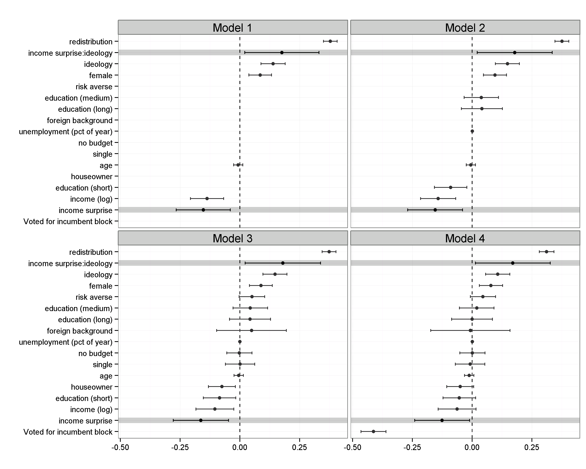

---
title: Great Expectations
author:
- name: Sebastian Barfort 
  affiliation: University of Copenhagen 
  email: sebastian.barfort@econ.ku.dk
date: March 2014
abstract: Lorem ipsum dolor sit amet, consectetur adipisicing elit, sed do eiusmod tempor incididunt ut labore et dolore magna aliqua. Ut enimad minim veniam, quis nostrud exercitation ullamco laboris nisi ut aliquip ex ea commodo consequat. Duis aute irure dolor in reprehenderit in voluptate velit esse cillum dolore eu fugiat nulla pariatur. Excepteur sint occaecat cupidatat non proident, sunt in culpa qui officia deserunt mollit anim id est laborum. quis nostrud exercitation ullamco laboris nisi ut aliquip ex ea commodo consequat. Duis aute irure dolor in reprehenderit in voluptate velit esse cillum dolore eu fugiat nulla pariatur. Excepteur sint occaecat cupidatat non proident, sunt in culpa qui officia deserunt mollit anim id est laborum.exercitation ullamco laboris nisi ut aliquip ex ea commodo consequat. Duis aute irure dolor in reprehenderit in voluptate velit esse cillum dolore eu fugiat nulla pariatur. Excepteur sint occaecat cupidatat non proident, sunt in culpa qui officia deserunt mollit anim id est laborum.
...

# 
hej hej hej polslsls olor sit amet, consectetur adipisicing elit, sed do eiusmod tempor incididunt ut labore et dolore magna aliqua [@fourcade13classsituat]. Notice that citation there [@healy02digittechnculturgoods]. Ut enimad minim veniam, quis nostrud exercitation ullamco laboris nisi ut aliquip ex ea commodo consequat. 
$\varepsilon \epsilon$

 

# Theory
Hej @test Lorem ipsum dolor sit amet, consectetur adipisicing elit, sed do eiusmod tempor incididunt ut labore et dolore magna aliqua. Ut enimad minim veniam, quis nostrud exercitation ullamco laboris nisi ut aliquip ex ea commodo consequat. Lorem ipsum dolor sit amet, consectetur adipisicing elit, sed do eiusmod tempor incididunt ut labore et dolore magna aliqua. Ut enimad minim veniam, quis nostrud exercitation ullamco laboris nisi ut aliquip ex ea commodo consequat. Duis aute irure dolor in reprehenderit in voluptate velit esse cillum dolore eu fugiat nulla 

(@foo)  $I = \int \rho R^{2} dV$

Hej @foo pariatur. Excepteur sint occaecat cupidatat non proident, sunt in culpa qui officia deserunt mollit anim id est laborum. Lorem ipsum dolor sit amet, consectetur adipisicing elit, sed do eiusmod tempor incididunt ut labore et dolore magna aliqua. Ut enimad minim veniam, quis nostrud exercitation ullamco laboris nisi ut aliquip ex ea commodo consequat. Duis aute irure dolor in reprehenderit in voluptate velit esse cillum dolore eu fugiat nulla pariatur. Excepteur sint occaecat cupidatat non proident, sunt in culpa qui officia deserunt mollit anim id est laborum.[^longnote]

(@joo)  $I = \int \rho R^{2} dV$

# Conclusion
Right now, your options for formatting bibliographies using Pandoc are to offload the work to biblatex (or natbib), or have pandoc handle everything via `citeproc` and CSL files. The latter way is simpler and cleaner, especially if we want to preserve the ability to easily generate both HTML and LaTeX/PDF outputs. You have to do two things. First, explicitly specify the "References" header. Second, pandoc does not (yet) support some standard layout options for bibliography entries---it will treat each entry like a regular paragraph, when we want the first lines of each bibliography entry to have no indentation, with subsequent lines (if any) to hang in from the margin. The LaTeX commands below the "References" header accomplish this . The LaTeX commands are ignored when HTML is produced, and do not show up in the output file.

-------------------------------------------------------------
 Centered   Default           Right Left
  Header    Aligned         Aligned Aligned
----------- ------- --------------- -------------------------
   First    row                12.0 Example of a row that
                                    spans multiple lines.

  Second    row                 5.0 Here's another one. Note
                                    the blank line between
                                    rows.
-------------------------------------------------------------

Table: Here's the caption. It, too, may span
multiple lines.

[^longnote]: Here is one with multiple blocks.

# References
\setlength{\parindent}{-0.2in}
\setlength{\leftskip}{0.2in}
\setlength{\parskip}{8pt}
\vspace*{-0.2in}
\noindent
